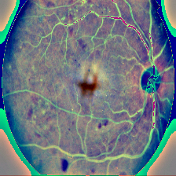

# 🔬 AI Diabetes Detection System
## AI-powered diabetes detection through retinal imaging and clinical data analysis

<div align="center">

[](https://www.python.org/)
[](https://tensorflow.org/)
[](LICENSE)
[](https://github.com/yourusername/diabetes-detection-ai)

</div>

---

## 📋 Table of Contents
- [🎯 Introduction](#-introduction)
- [✨ Features](#-features)
- [🏗️ System Architecture](#️-system-architecture)
- [🚀 Installation](#-installation)
- [📁 Data](#-data)

---

## 🎯 Introduction

### 🚨 The Problem: Diabetic Retinopathy Crisis
<div align="center">


</div>

> **Diabetic Retinopathy (DR)** is a leading cause of preventable blindness worldwide, affecting over **126 million people** with around **37 million** at vision-threatening stages.

**Key Challenges:**
- 🩸 **Diabetes damages retinal blood vessels** causing DR
- 🏥 **Limited access to ophthalmic care** in rural and low-income areas
- ⏰ **Early screening is critical** for preventing vision loss
- 💰 **Huge economic burden** on healthcare systems

### 🎯 Our Solution

This project develops an **advanced AI system** for diabetes detection and related complications through:

<table>
<tr>
<td width="50%">

**🔍 Retinal Image Analysis**
- Detection of diabetic retinopathy
- Severity classification (0-4 scale)
- Automated screening capability

</td>
<td width="50%">

**📊 Clinical Data Analysis**
- Diabetes risk prediction
- Medical indicators analysis
- Ensemble ML algorithms

</td>
</tr>
</table>

### 🤖 Discord Chatbot Integration
We've integrated our AI system into a **Discord chatbot** for easy access and real-time consultations!

<div align="center">

</div>

---

## ✨ Features

<table>
<tr>
<td width="33%">

### 🔍 DR Detection
- **Severity Classification**: 0-4 scale
- **Sign Detection**: Microaneurysms, hemorrhages, exudates
- **Accuracy**: 84.72%

</td>
<td width="33%">

### 📊 Risk Prediction
- **Clinical Analysis**:age, bmi, gender, glucose_apache, creatinine_apache, bun_apache, sodium_apache, albumin_apache
- **Ensemble Models**: Multiple ML algorithm
- **Performance**: 86.43% accuracy

</td>
<td width="33%">

### 🌐 User Interface
- **Web Application**: Easy upload & analysis
- **Discord Bot**: Real-time consultations
- **Batch Processing**: Multiple files support
- **Detailed Reports**: With visualizations

</td>
</tr>
</table>

---

## 🏗️ System Architecture

<div align="center">

</div>

# 1. Image Processing

<div align="center">

</div>

#### A. Smart Cropping
```python
def crop_image_from_gray_to_color(img, tol=7):
    """Remove black borders around retinal images"""
    gray = cv2.cvtColor(img, cv2.COLOR_RGB2GRAY)
    mask = gray > tol
    rows = mask.any(axis=1)
    cols = mask.any(axis=0)
    return img[np.ix_(rows, cols)]
```

#### B. Image Enhancement
```python
def load_ben_color(path, sigmaX=10, IMG_SIZE=244):
    """Process images using Ben Graham's method"""
    image = cv2.imread(path)
    image = cv2.cvtColor(image, cv2.COLOR_BGR2RGB)
    
    # Remove dark regions
    image = crop_image_from_gray_to_color(image, tol=7)
    
    # Standardize size
    image = cv2.resize(image, (IMG_SIZE, IMG_SIZE))
    
    # Enhance contrast
    # Formula: 4*original - 4*blurred + 128
    image = cv2.addWeighted(image, 4, cv2.GaussianBlur(image, (0, 0), sigmaX), -4, 128)
    
    return image
```

**Why is this important?**
- **Cropping**: Removes black areas with no medical information
- **Enhancement**: Highlights blood vessels and retinal lesions
- **Resize**: Standardizes dimensions for model input

### C. Batch Processing
```python
processed_ids = []
for idx, row in df_train.iterrows():
    img_filename = f"{row['id_code']}.png"
    img_path = os.path.join(train_img_folder, img_filename)
    
    try:
        proc_img = load_ben_color(img_path, sigmaX=10, IMG_SIZE=244)
        proc_img_bgr = cv2.cvtColor(proc_img, cv2.COLOR_RGB2BGR)
        cv2.imwrite(os.path.join(processed_folder, img_filename), proc_img_bgr)
        processed_ids.append(row['id_code'])
    except Exception as e:
        print(f"Error {img_filename}: {e}")
```

### D. Data Splitting
```python
# Prepare data
x = df_train_processed['id_code']
y = df_train_processed['diagnosis']
x, y = shuffle(x, y, random_state=42)

# Split Train(68%) - Val(12%) - Test(20%)
x_temp, test_x, y_temp, test_y = train_test_split(x, y, test_size=0.20, stratify=y, random_state=42)
train_x, valid_x, train_y, valid_y = train_test_split(x_temp, y_temp, test_size=0.15/0.80, stratify=y_temp, random_state=42)
```

## 🔑 Key Points

### Image Processing Techniques
1. **Smart Cropping**: Keep only medically relevant regions
2. **Contrast Enhancement**: Formula `4*original - 4*blurred + 128`
3. **Standardization**: 244x244 pixels but next step, we have resize image:299x299 (Xception and InceptionV3)

### Data Transformation
- **Input**: Raw images with varying sizes and black borders
- **Output**: 244x244 images with enhanced contrast, retina only


| Original image (NO DIABETES) | Processed image (NO DIABETES) |
|----------|-------------|
|  |     |

| Original image (DIABETES) | Processed image (DIABETES)|
|----------|-------------|
|  |     |

[📥 Tải mã xử lý ảnh tại đây](https://github.com/hungle2006/Diabetes-AI/raw/main/model/Processing_images.py)

---

# 2. CNN-MODEL


## 📋 Overview

This project implements a multi-model ensemble approach for diabetic retinopathy classification, utilizing advanced deep learning techniques including:
- Multiple pre-trained CNN architectures
- Dynamic data augmentation
- Class balancing strategies
- Grad-CAM visualization
- Meta-learning feature extraction

## 🎯 Key Features

### Multi-Model Architecture Support
- **ResNet50**: Deep residual networks for robust feature extraction
- **EfficientNetB0**: Efficient scaling for optimal performance
- **InceptionV3**: Multi-scale feature processing
- **DenseNet121**: Dense connections for feature reuse
- **Xception**: Depthwise separable convolutions

### Advanced Training Techniques
- **Dynamic Class Balancing**: Automatic adjustment of class weights during training
- **Mixup Augmentation**: Advanced data augmentation for better generalization
- **Rare Class Augmentation**: Targeted augmentation for underrepresented classes
- **Progressive Learning**: Two-stage training with frozen and unfrozen layers

### Intelligent Callbacks
- **QWK Evaluation**: Quadratic Weighted Kappa scoring for medical accuracy
- **Dynamic Learning Rate**: Adaptive learning rate based on QWK performance
- **Early Stopping**: Prevention of overfitting with best weight restoration

## 🏗️ Architecture

### Data Generator (`My_Generator`)
```python
class My_Generator(tf.keras.utils.Sequence):
    def __init__(self, image_filenames, labels, batch_size, is_train=False,
                 mix=False, augment=False, size1=224, size2=299, model_type="default",
                 balance_classes=False):
        self.image_filenames = np.array(image_filenames)
        self.labels = np.array(labels)
        self.batch_size = batch_size
        self.is_train = is_train
        self.is_augment = augment
        self.is_mix = mix
        self.model_type = str(model_type).lower()
        self.n_classes = self.labels.shape[1] if self.labels.ndim > 1 else int(max(self.labels) + 1)
        if "inceptionv3" in self.model_type or "xception" in self.model_type:
            self.target_size = (size2, size2)
        else:
            self.target_size = (size1, size1)
        self.base_path = "/content/processed_train_images/"
        if self.is_augment and self.is_train:
            self.augmenter = A.Compose([
                A.OneOf([
                    A.RandomBrightnessContrast(brightness_limit=0.1, contrast_limit=0, p=1),
                    A.MultiplicativeNoise(multiplier=(0.9, 1.1), per_channel=True, p=1),
                    A.RandomBrightnessContrast(brightness_limit=0, contrast_limit=0.1, p=1)
                ], p=0.5),
                A.HorizontalFlip(p=0.5),
                A.VerticalFlip(p=0.5),
                A.CropAndPad(percent=(-0.1, 0), p=0.5)
            ])
        self.rare_augmenter = A.Compose([
            A.HorizontalFlip(p=0.5),
            A.VerticalFlip(p=0.5),
            A.RandomBrightnessContrast(brightness_limit=0.2, contrast_limit=0.2, p=0.7),
            A.GaussNoise(p=0.5),
            A.Rotate(limit=30, p=0.5),
            A.RandomScale(scale_limit=0.2, p=0.5),
            A.ShiftScaleRotate(shift_limit=0.1, scale_limit=0.1, rotate_limit=15, p=0.5),
            A.HueSaturationValue(hue_shift_limit=20, sat_shift_limit=30, val_shift_limit=20, p=0.5)
        ])
        self.class_counts = self._compute_initial_class_counts()
        self.augmented_class_counts = self.class_counts.copy()
        self.class_weights = None
        if self.is_train and balance_classes:
            self.balance_class()
        if self.is_train:
            self.on_epoch_end()

    def _compute_initial_class_counts(self):
        labels = np.argmax(self.labels, axis=1) if self.labels.ndim > 1 else self.labels
        return np.bincount(labels, minlength=self.n_classes)

    def _compute_class_weights(self):
        total_samples = np.sum(self.augmented_class_counts)
        if total_samples == 0:
            return np.ones(self.n_classes)
        class_weights = total_samples / (self.n_classes * self.augmented_class_counts)
        class_weights = np.where(np.isinf(class_weights) | (self.augmented_class_counts == 0), 1.0, class_weights)
        return class_weights / np.min(class_weights[np.isfinite(class_weights)])

    def get_class_weights(self):
        """Return the current class weights for training."""
        return self.class_weights

    def balance_classes(self):
        class_counts = self._compute_initial_class_counts()
        max_count = class_counts[0]  # Use the number of samples in class 0 as the target

        print(f"Initial sample counts: {class_counts}")
        print(f"Target sample count per class (based on class 0): {max_count}")

        new_filenames = []
        new_labels = []
        for cls in range(self.n_classes):
            current_count = class_counts[cls]
            if current_count == 0:
                print(f"Class {cls} has no samples, skipping.")
                continue
            if cls == 3:
                target_count = int(max_count * 1.3)  # Class 3 is increased by 30%
            else:
                target_count = max_count
            if current_count < target_count:
                samples_to_add = target_count - current_count
                label_indices = np.argmax(self.labels, axis=1) if self.labels.ndim > 1 else self.labels
                class_indices = np.where(label_indices == cls)[0]
                for i in range(samples_to_add):
                    idx = np.random.choice(class_indices)
                    img_id = self.image_filenames[idx]
                    label = self.labels[idx]
                    img = self._load_image(img_id)
                    if img is None:
                        continue
                    aug_img = self.rare_augmenter(image=img)['image']
                    new_img_id = f"{img_id}_balance_aug_{i}"
                    save_path = os.path.join(self.base_path, f"{new_img_id}.png")
                    if cv2.imwrite(save_path, cv2.cvtColor(aug_img, cv2.COLOR_RGB2BGR)):
                        new_filenames.append(new_img_id)
                        new_labels.append(np.array(label, dtype=self.labels.dtype))
                        self.augmented_class_counts[cls] += 1
                    else:
                        print(f"Error saving augmented image {new_img_id}")

        if new_labels:
            new_labels_array = np.array(new_labels)
            if new_labels_array.ndim == 1:
                new_labels_array = new_labels_array[:, np.newaxis]
            self.image_filenames = np.concatenate([self.image_filenames, new_filenames])
            self.labels = np.concatenate([self.labels, new_labels_array])

        # Do not call on_epoch_end() here to avoid recalculating class weights immediately

        # Check sample counts after balancing
        updated_counts = self._compute_initial_class_counts()
        print(f"Sample counts after balancing and augmenting class 3: {updated_counts}")

    def augment_weak_classes(self, weak_classes, augment_factor=2):
        new_filenames = []
        new_labels = []
        for idx, label in enumerate(self.labels):
            label_class = np.argmax(label) if label.ndim > 1 else label
            if np.isscalar(label_class) and np.isin(label_class, weak_classes):
                img_id = self.image_filenames[idx]
                img = self._load_image(img_id)
                if img is None:
                    continue
                for i in range(augment_factor):
                    aug_img = self.rare_augmenter(image=img)['image']
                    new_img_id = f"{img_id}_weak_aug_{i}"
                    save_path = os.path.join(self.base_path, f"{new_img_id}.png")
                    if cv2.imwrite(save_path, cv2.cvtColor(aug_img, cv2.COLOR_RGB2BGR)):
                        new_filenames.append(new_img_id)
                        new_labels.append(np.array(label, dtype=self.labels.dtype))
                        self.augmented_class_counts[label_class] += 1
                    else:
                        print(f"Error saving augmented image {new_img_id}")
        if new_labels:
            new_labels_array = np.array(new_labels)
            if new_labels_array.ndim == 1:
                new_labels_array = new_labels_array[:, np.newaxis]
            self.image_filenames = np.concatenate([self.image_filenames, new_filenames])
            self.labels = np.concatenate([self.labels, new_labels_array])

    def __len__(self):
        return int(np.ceil(len(self.image_filenames) / self.batch_size))

    def __getitem__(self, idx):
        batch_x = self.image_filenames[idx * self.batch_size:(idx + 1) * self.batch_size]
        batch_y = self.labels[idx * self.batch_size:(idx + 1) * self.batch_size]
        return self._generate_batch(batch_x, batch_y, augment=self.is_train)

    def on_epoch_end(self):
        if self.is_train:
            self.image_filenames, self.labels = shuffle(self.image_filenames, self.labels)
            # Calculate class weights at the end of each epoch
            self.class_weights = self._compute_class_weights()
            print(f"Class weights after epoch: {self.class_weights}")
            print(f"Augmented sample counts: {self.augmented_class_counts}")

    def _load_image(self, img_id):
        img_path = os.path.join(self.base_path, f"{img_id}.png")
        try:
            img = cv2.imread(img_path)
            if img is None:
                raise ValueError(f"Image not found or corrupted: {img_path}")
            img = cv2.cvtColor(img, cv2.COLOR_BGR2RGB)
            img = cv2.resize(img, self.target_size)
            return img
        except Exception as e:
            print(f"Error loading image {img_id}: {str(e)}")
            return None

    def _generate_batch(self, batch_x, batch_y, augment=False):
        batch_images = []
        valid_labels = []

        for img_id, label in zip(batch_x, batch_y):
            img = self._load_image(img_id)
            if img is None:
                continue
            if augment and self.is_augment:
                img = self.augmenter(image=img.astype(np.uint8))['image']
            img = img.astype(np.float32) / 255.0

            if "resnet50" in self.model_type:
                img = resnet50_preprocess(img)
            elif "efficientnetb0" in self.model_type:
                img = efficientnet_preprocess(img)
            elif "inceptionv3" in self.model_type:
                img = inception_preprocess(img)
            elif "densenet121" in self.model_type:
                img = densenet_preprocess(img)
            elif "xception" in self.model_type:
                img = xception_preprocess(img)

            batch_images.append(img)
            valid_labels.append(label)

        if not batch_images:
            return np.zeros((1, *self.target_size, 3), dtype=np.float32), np.zeros((1, *batch_y.shape[1:]), dtype=np.float32)

        batch_images = np.array(batch_images)
        valid_labels = np.array(valid_labels)

        if self.is_mix and len(batch_images) > 1:
            batch_images, valid_labels = self._mixup(batch_images, valid_labels)

        return batch_images, valid_labels

    def _mixup(self, x, y):
        lam = np.random.beta(0.2, 0.4)
        index = np.random.permutation(len(x))
        mixed_x = np.zeros_like(x)
        mixed_y = np.zeros_like(y)
        for i in range(len(x)):
            if np.argmax(y[i]) == np.argmax(y[index[i]]):
                mixed_x[i] = lam * x[i] + (1 - lam) * x[index[i]]
                mixed_y[i] = y[i]
            else:
                mixed_x[i] = x[i]
                mixed_y[i] = y[i]
        return mixed_x, mixed_y
```

### Model Creation
```python
def create_model(input_shape, n_out, model_type, weights_path=None, weights="imagenet"):
    input_tensor = Input(shape=input_shape)
    if model_type == "resnet50":
        base_model = ResNet50(include_top=False, weights=weights if not weights_path else None, input_tensor=input_tensor)
    elif model_type == "efficientnetb0":
        base_model = EfficientNetB0(include_top=False, weights=weights if not weights_path else None, input_tensor=input_tensor)
    elif model_type == "inceptionv3":
        base_model = InceptionV3(include_top=False, weights=weights if not weights_path else None, input_tensor=input_tensor)
    elif model_type == "densenet121":
        base_model = DenseNet121(include_top=False, weights=weights if not weights_path else None, input_tensor=input_tensor)
    elif model_type == "xception":
        base_model = Xception(include_top=False, weights=weights if not weights_path else None, input_tensor=input_tensor)
    else:
        raise ValueError(f"Unsupported model type: {model_type}")
    if weights_path:
        try:
            base_model.load_weights(weights_path)
            print(f"Loaded weights from {weights_path}")
        except Exception as e:
            print(f"Error loading weights from {weights_path}: {e}")
            raise
    x = GlobalAveragePooling2D(name='global_avg_pool')(base_model.output)
    x = Dropout(0.5)(x)
    x = Dense(1024, activation='relu')(x)
    x = Dropout(0.5)(x)
    final_output = Dense(n_out, activation="softmax", name='final_output')(x)
    model = Model(input_tensor, final_output)
    return model
```

## 📊 Performance Monitoring

### Metrics Tracked
- **Quadratic Weighted Kappa (QWK)**: Primary metric for medical classification
- **F1-Score per Class**: Detailed performance analysis
- **Sensitivity/Recall**: True positive rate per class
- **Specificity**: True negative rate per class
- **Precision**: Positive predictive value

### Visualization Tools
- **Grad-CAM**: Visual explanation of model decisions
- **Confusion Matrix**: Detailed classification results
- **Loss Curves**: Training progress monitoring

## 🔧 Training Pipeline

### Stage 1: Transfer Learning
```python
# Freeze base model layers
for layer in model.layers[:50]:
    layer.trainable = False

# Train classification head
model.compile(
    loss=CategoricalCrossentropy(label_smoothing=0.1),
    optimizer=Adam(learning_rate=1e-4),
    metrics=['accuracy']
)
```

### Stage 2: Fine-tuning
```python
# Unfreeze all layers
for layer in model.layers:
    layer.trainable = True

# Fine-tune with mixup
train_mixup = My_Generator(
    is_train=True, 
    mix=True, 
    augment=True,
    balance_classes=True
)
```

## 🎨 Data Augmentation

### Standard Augmentation
- Random brightness/contrast adjustment
- Horizontal and vertical flips
- Multiplicative noise
- Crop and pad operations

### Rare Class Augmentation
- Gaussian noise addition
- Rotation and scaling
- Hue/saturation/value shifts
- Shift-scale-rotate transformations

## 🧠 Meta-Learning Features

### Feature Extraction
```python
def extract_features(model, generator, steps, model_type, save_path):
    """Extract 2D and 4D features from the model."""
    # Get the name of the last convolutional layer
    last_conv_layer_name = get_last_conv_layer(model, model_type)

    # Create feature model
    feature_model = Model(
        inputs=model.input,
        outputs=[
            model.get_layer(last_conv_layer_name).output,  # 4D features
            model.get_layer('global_avg_pool').output      # 2D features
        ]
    )

    features_4d = []
    features_2d = []
    labels = []

    # Extract features from generator
    for i in range(steps):
        batch_images, batch_labels = generator[i]
        batch_features_4d, batch_features_2d = feature_model.predict(batch_images, verbose=0)
        features_4d.append(batch_features_4d)
        features_2d.append(batch_features_2d)
        labels.append(batch_labels)

    # Convert to NumPy arrays
    features_4d = np.concatenate(features_4d, axis=0)
    features_2d = np.concatenate(features_2d, axis=0)
    labels = np.concatenate(labels, axis=0)

    # Save features
    np.savez(save_path, features_4d=features_4d, features_2d=features_2d, labels=labels)
    print(f"Saved features at {save_path}: 4D shape {features_4d.shape}, 2D shape {features_2d.shape}")
    return features_4d, features_2d, labels
```

### Multi-Scale Feature Fusion
- Combines features from multiple model architectures
- Reduces 4D features to 2D using global average pooling
- Creates comprehensive feature representation

## 📈 Results Analysis

### Automatic Evaluation
- Best model checkpointing based on QWK score
- Comprehensive test set evaluation
- Per-class performance metrics
- Confusion matrix generation

### Visual Interpretability
- Grad-CAM heatmaps for model decision explanation
- Original vs. augmented image comparisons
- Class activation visualizations

### Training
```python
# Configure model
model_configs = {
    "densenet121": {
        "model_type": "densenet121",
        "weights_path": "path/to/weights.h5",
        "save_path": "path/to/save/model.h5"
    }
}

# Train model
for model_name, config in model_configs.items():
    model = create_model(
        input_shape=(224, 224, 3),
        n_out=NUM_CLASSES,
        model_type=config["model_type"]
    )
    # ... training loop
```

### Evaluation
```python
# Evaluate on test set
y_pred = model.predict(test_generator)
qwk_score = cohen_kappa_score(y_true, y_pred, weights='quadratic')
```

## 📁 Project Structure

<div align="center">

</div>

## 🔬 Technical Details

### Class Balancing Strategy
- Analyzes initial class distribution
- Generates synthetic samples for underrepresented classes
- Implements targeted augmentation for class 3 (30% increase because between class 3 and class 4 is difficult to distinguish. In addition, class 3 accuracy is below 30)
- Dynamic weight adjustment during training

### Quality Assurance
- Comprehensive error handling for image loading
- Automatic validation of generated samples
- Robust preprocessing pipeline
- Memory-efficient batch processing

## 📊 Model Performance

### Evaluation Metrics
- **Primary**: Quadratic Weighted Kappa (QWK)
- **Secondary**: F1-Score, Sensitivity, Specificity, Precision
- **Visualization**: Grad-CAM, Confusion Matrix

### Checkpoint Management
- Best model saving based on QWK score
- Multiple save formats (Keras, weights, JSON config)
- Metadata tracking for reproducibility

### Training and test results

<div align="center">

</div>

📥 [Tải file cnn_model.py](https://raw.githubusercontent.com/hungle2006/Diabetes-AI/main/model/cnn_model.py)

---

# 3. Medical Image Classification Project with Meta-Learning (MAML/FOMAML)

## Introduction

This project implements a medical image classification system using meta-learning techniques such as Model-Agnostic Meta-Learning (MAML) and First-Order MAML (FOMAML). The codebase focuses on processing image data, extracting features from pre-trained deep learning models like EfficientNet, Xception, InceptionV3, ResNet50, and DenseNet121, and applying meta-learning to improve classification performance on imbalanced datasets. The project also incorporates techniques like Grad-CAM for visualization and Focal Loss to handle minority classes.

The project is designed to work with medical image datasets, such as retinal images for diagnosing diseases. The codebase includes data preprocessing, class balancing, feature extraction, and meta-learning model training with strategies like data augmentation and class balancing.

## Key Features

- **Data Preprocessing**: Load and process images from directories or compressed files, convert to RGB format, and resize images.
- **Data Balancing**: Use techniques like oversampling and random erasing to address class imbalance.
- **Feature Extraction**: Extract 2D and 4D features from pre-trained deep learning models (EfficientNetB0, Xception, InceptionV3, ResNet50, DenseNet121).
- **Meta-Learning (MAML/FOMAML)**: Train meta-learning models with inner and outer loops, integrating Focal Loss to focus on minority classes.
- **Grad-CAM Visualization**: Generate heatmaps to visualize important regions in images, aiding in interpreting model predictions.
- **Performance Evaluation**: Use Quadratic Weighted Kappa (QWK), Precision, Recall, and F1-score to evaluate model performance.
- **Storage and Management**: Save features, models, and evaluation metrics to .npy, .json, and .h5 files.

## Code Structure

Below are the main components of the codebase:

### A. Data Loading and Preprocessing

- `load_original_image(image_id, extract_dir)`: Load original images from an extracted directory based on image_id. Convert images to RGB and handle errors if images are not found.
- `load_processed_image(image_id, processed_folder, size)`: Load preprocessed images, resize them, and convert to RGB.

```python
def load_original_image(image_id, extract_dir):
    try:
        image_id = image_id.replace('.png', '').replace('.jpg', '').replace('.jpeg', '')
        for root, _, files in os.walk(extract_dir):
            for file in files:
                if file.lower().startswith(image_id.lower()) and file.lower().endswith(('.jpg', '.jpeg', '.png')):
                    img_path = os.path.join(root, file)
                    img = cv2.imread(img_path)
                    if img is None:
                        logging.error(f"Could not read image at: {img_path}")
                        return None
                    img = cv2.cvtColor(img, cv2.COLOR_BGR2RGB)
                    return img
        logging.warning(f"Image not found for ID: {image_id} in {extract_dir}")
        return None
    except Exception as e:
        logging.error(f"Error loading original image {image_id}: {str(e)}")
        return None
```

### B. Data Augmentation and Balancing

- `custom_random_erasing(image, scale, ratio, p)`: Apply random erasing to augment image data, helping the model learn more robust features.
- `balance_and_augment_data(images, labels, target_classes, samples_per_class)`: Balance the number of samples across classes using augmentation techniques like horizontal flipping, rotation, brightness adjustment, and Gaussian noise.

```python
def balance_and_augment_data(images, labels, target_classes=[0, 1, 2, 3, 4], samples_per_class=None):
    num_classes = labels.shape[1]
    label_indices = np.argmax(labels, axis=1)
    keep_indices = np.isin(label_indices, target_classes)
    filtered_images = images[keep_indices]
    filtered_labels = labels[keep_indices]
    filtered_label_indices = label_indices[keep_indices]
    
    class_counts = np.bincount(filtered_label_indices, minlength=num_classes)
    print(f"Initial distribution: {dict(zip(range(num_classes), class_counts))}")
    
    max_count = samples_per_class or max(class_counts)
    augmenter = A.Compose([
        A.HorizontalFlip(p=0.5),
        A.Rotate(limit=15, p=0.3),
        A.RandomBrightnessContrast(brightness_limit=0.1, contrast_limit=0.1, p=0.3),
        A.GaussNoise(p=0.2),
        A.CLAHE(clip_limit=1.0, tile_grid_size=(8, 8), p=0.2),
    ])
    
    new_images, new_labels = [], []
    for cls in target_classes:
        cls_indices = np.where(filtered_label_indices == cls)[0]
        cls_images = filtered_images[cls_indices]
        cls_labels = filtered_labels[cls_indices]
        current_count = len(cls_indices)
        new_images.extend(cls_images)
        new_labels.extend(cls_labels)
        augment_count = max_count - current_count
        if augment_count > 0:
            for _ in range(augment_count):
                idx = np.random.choice(cls_indices)
                img = filtered_images[idx].astype(np.uint8)
                aug_img = augmenter(image=img)['image']
                aug_img = custom_random_erasing(aug_img, scale=(0.01, 0.05), ratio=(0.5, 2.0), p=0.3)
                new_images.append(aug_img)
                new_labels.append(filtered_labels[idx])
    
    new_images = np.array(new_images, dtype=np.float32)
    new_labels = np.array(new_labels, dtype=np.float32)
    return new_images, new_labels
```

### C. Feature Extraction

- `extract_2d_features(model_name, config, generator, save_dir, sample_ids)`: Extract 2D features from deep learning models and save them to .npy files.
- `load_4d_features(model_name, split)`: Load 4D features from .npz files and reduce them to 2D using averaging.
- `combine_and_reduce_features(features_2d_dict, features_4d_dict, labels, sample_ids, save_dir, n_components)`: Combine 2D and 4D features, apply PCA for dimensionality reduction, and ensure synchronization between features and labels.

### D. Meta-Learning (MAML/FOMAML)


<div align="center">

</div>


**maml_fomaml_train_manual**:
- **Objective**: Train a meta-learning model with an inner loop to update weights on the support set and an outer loop to update the meta-model on the query set.
- **Components**:
  - Model: Uses custom layers like MemoryAugmentedLayer, GradientReversalLayer, and CustomGridDropout.
  - **MemoryAugmentedLayer**: Memorize and reuse features from encountered patterns, Improve generalization across episodes with limited number of patterns.
 
    ```python
    class MemoryAugmentedLayer(tf.keras.layers.Layer):
          def __init__(self, memory_size, memory_dim, **kwargs):
              super().__init__(**kwargs)
              self.memory_size = memory_size
              self.memory_dim = memory_dim
              self.memory_projection = None  # Chuyển Dense vào đây

          def build(self, input_shape):
              self.input_dim = input_shape[-1]

              self.memory = self.add_weight(
                  shape=(self.memory_size, self.memory_dim),
                  initializer='zeros',
                  trainable=False,
                  name='memory',
                  dtype=tf.float32
              )

              if self.memory_dim != self.input_dim:
                  self.memory_projection = tf.keras.layers.Dense(self.input_dim, use_bias=False, name="memory_projection")

              super().build(input_shape)

          def call(self, inputs):
              if len(inputs.shape) != 2:
                  logging.warning(f"Đầu vào MemoryAugmentedLayer không phải 2D: {inputs.shape}, reshape về 2D")
                  inputs = tf.reshape(inputs, [-1, inputs.shape[-1]])

              batch_size = tf.shape(inputs)[0]
              memory_size = tf.shape(self.memory)[0]

              memory_sliced = tf.cond(
                  tf.greater(batch_size, memory_size),
                  lambda: tf.tile(self.memory, [(batch_size + memory_size - 1) // memory_size, 1])[:batch_size],
                  lambda: self.memory[:batch_size]
              )

              if self.memory_projection is not None:
                  memory_sliced = self.memory_projection(memory_sliced)

              stacked = tf.stack([inputs, memory_sliced], axis=0)
              output = tf.reduce_mean(stacked, axis=0)
              return output

          def compute_output_shape(self, input_shape):
              return (input_shape[0], input_shape[-1])

          def get_config(self):
              config = super().get_config()
              config.update({
                  'memory_size': self.memory_size,
                  'memory_dim': self.memory_dim,
              })
              return config
    ```
  - **GradientReversalLayer**:
    - Main direction: Give the taxonomic branch a good feature (class discrimination).
    - Reverse direction: Give the domain discrimination branch a good feature discrimination so that it cannot discriminate the domain → the feature will be invariant with the domain.
      
    ```python
    class GradientReversalLayer(tf.keras.layers.Layer):
    def __init__(self, lambda_=1.0, **kwargs):
        super().__init__(**kwargs)
        self.lambda_ = lambda_

    def call(self, inputs):
        return tf.keras.backend.stop_gradient(inputs) * (-self.lambda_)

    def compute_output_shape(self, input_shape):
        return input_shape

    def get_config(self):
        config = super().get_config()
        config.update({'lambda_': self.lambda_})
        return config
    ```

  - **CustomGridDropout**: is a custom layer commonly used to reduce overfitting by masking small grid-like regions in the input feature. Unlike regular Dropout (which randomly drops elements), GridDropout masks continuous regions – often used for images or spatial features.


    ```python
    class CustomGridDropout(tf.keras.layers.Layer):
    def __init__(self, ratio, holes_number, p, **kwargs):
        super().__init__(**kwargs)
        self.ratio = ratio
        self.holes_number = holes_number
        self.p = p

    def call(self, inputs, training=None):
        if not training:
            return inputs

        batch_size = tf.shape(inputs)[0]
        feature_dim = tf.shape(inputs)[1]

        # Example dropout logic (simplified)
        mask = tf.random.uniform([batch_size, feature_dim]) > self.p
        mask = tf.cast(mask, tf.float32)
        return inputs * mask / (1 - self.p)

    def compute_output_shape(self, input_shape):
        return input_shape

    def get_config(self):
        config = super().get_config()
        config.update({'ratio': self.ratio, 'holes_number': self.holes_number, 'p': self.p})
        return config
    ```

    
  - Loss: Combines Focal Loss, domain loss, and prototypical loss.
  - Optimization: Uses Adam optimizer with learning rate scheduling and early stopping.
- **Output**: Meta-model, classification model, feature extraction model, and training history.

```python
def maml_fomaml_train_manual(
    features, labels, valid_features, valid_labels, input_dim, n_episodes=50,
    n_support=15, n_query=10, inner_lr=0.001, outer_lr=0.001, fine_tune_lr=0.0001,
    use_fomaml=True, memory_size=20, sample_ids=None, images=None, features_4d_dict=None
):
    # Define model
    def create_model(input_dim):
        inputs = tf.keras.Input(shape=(input_dim,), dtype=tf.float32)
        x = tf.keras.layers.Dense(256, activation='relu', kernel_regularizer=tf.keras.regularizers.l2(0.1))(inputs)
        x = tf.keras.layers.BatchNormalization()(x)
        x = CustomGridDropout(ratio=0.3, holes_number=10, p=0.3)(x)
        x = tf.keras.layers.Dropout(0.7)(x)
        x = tf.keras.layers.Dense(128, activation='relu', kernel_regularizer=tf.keras.regularizers.l2(0.1))(x)
        x = tf.keras.layers.BatchNormalization()(x)
        x = CustomGridDropout(ratio=0.3, holes_number=5,  p=0.3)(x)
        x = tf.keras.layers.Dropout(0.3)(x)
        x = tf.keras.layers.Dense(64, activation='relu', kernel_regularizer=tf.keras.regularizers.l2(0.1))(x)
        x = tf.keras.layers.BatchNormalization()(x)
        feature_output = x
        x = MemoryAugmentedLayer(memory_size=memory_size, memory_dim=64)(x)
        classification_output = tf.keras.layers.Dense(NUM_CLASSES, activation='softmax', name='classification')(x)
        domain_inputs = GradientReversalLayer(lambda_=1.0)(x)
        domain_x = tf.keras.layers.Dense(32, activation='relu')(domain_inputs)
        domain_output = tf.keras.layers.Dense(2, activation='softmax', name='domain')(domain_x)
        model = tf.keras.Model(inputs=inputs, outputs=[classification_output, domain_output])
        classification_model = tf.keras.Model(inputs=inputs, outputs=classification_output)
        feature_model = tf.keras.Model(inputs=inputs, outputs=feature_output)
        return model, classification_model, feature_model

    meta_model, meta_classification_model, feature_model = create_model(input_dim)
    # Continue with MAML/FOMAML training loop
    # ...
```

- **Domain Classifier**: is a branch in the model, designed to distinguish the domain of the data (for example, the data source is from hospital A or B), thereby helping the model learn general features (domain-invariant features). Combined with Gradient Reversal Layer (GRL) to reverse the gradient during training → the model will intentionally do poorly in discriminating domains → from there the learned features are "common" between domains.


<div align="center">

</div>

- **Bi-Level Optimization Diagram:**
   - **a. Sample a batch of tasks:**
  
  ```python
  def sample_balanced_task(features, labels, n_support, n_query, n_way, min_required=2):
    is_image_input = features.ndim == 4 and features.shape[-1] in [1, 3]  # Support RGB or grayscale
    label_indices = tf.argmax(labels, axis=1).numpy()
    unique_classes, counts = np.unique(label_indices, return_counts=True)
    class_counts = dict(zip(unique_classes, counts))

    # Adjust n_support/n_query if needed
    while n_support + n_query >= min_required:
        class_data = {cls: np.where(label_indices == cls)[0] for cls in unique_classes if class_counts[cls] >= min_required}
        if len(class_data) >= min(n_way, len(unique_classes)):
            break
        if n_support > 1:
            n_support -= 1
        elif n_query > 1:
            n_query -= 1
        else:
            break

    if not class_data:
        raise ValueError("Không có lớp nào đủ mẫu để tạo balanced task.")

    # Select classes
    eligible_classes = list(class_data.keys())
    eligible_counts = np.array([class_counts[c] for c in eligible_classes])
    class_probs = 1.0 / (eligible_counts + 1e-6)
    class_probs /= class_probs.sum()
    replace_classes = len(eligible_classes) < n_way
    selected_classes = np.random.choice(eligible_classes, size=n_way, replace=replace_classes, p=class_probs)

    task_features, task_labels = [], []

    for cls in selected_classes:
        cls_indices = class_data[cls]
        total_needed = n_support + n_query
        replace_sampling = len(cls_indices) < total_needed
        selected = np.random.choice(cls_indices, size=total_needed, replace=replace_sampling)

        feats = tf.gather(features, selected).numpy()
        labs = tf.gather(labels, selected).numpy()

        if is_image_input:
            height, width = feats.shape[1:3]
            augmenter = create_augmenter(height, width, is_image=True)
            feats_aug = []
            for feat in feats:
                aug_img = augmenter(image=feat.astype(np.uint8))['image']
                aug_img = custom_random_erasing(aug_img.astype(np.float32), is_image=True)
                feats_aug.append(aug_img)
            feats = np.stack(feats_aug, axis=0)
        else:
            augmenter = create_augmenter(is_image=False)
            feats_aug = []
            for feat in feats:
                aug_feat = augmenter(feat.astype(np.float32))
                aug_feat = custom_random_erasing(aug_feat, is_image=False)
                feats_aug.append(aug_feat)
            feats = np.stack(feats_aug, axis=0)

        task_features.append(tf.convert_to_tensor(feats, dtype=tf.float32))
        task_labels.append(tf.convert_to_tensor(labs, dtype=tf.float32))

    features = tf.concat(task_features, axis=0)
    labels = tf.concat(task_labels, axis=0)

    if tf.math.reduce_any(tf.math.is_nan(labels)) or tf.math.reduce_any(tf.math.is_inf(labels)):
        raise ValueError("Nhãn chứa NaN hoặc inf sau tăng cường")

    return features, labels
  ```
  
    - **Generate a task consisting of**:
      - n_way randomly selected layers.
      - Each layer has n_support samples for training and n_query samples for testing.
      - Augmentation is applied to all samples.
      - Can handle both images (4D) and feature vectors (2D).

    - **Meta-task:**
      ```
      Meta-task:
           ├── Support Set (n_way × k_shot)
           │   └── Used for quick training (inner loop)
           └── Query Set (n_way × q_query)
               └── Used to evaluate and update the meta-model (outer loop)
      ```
        
- **b. Inner-loop:**
  
  ```python
  # Inner loop
        for _ in range(15):
            with tf.GradientTape() as tape:
                class_preds, domain_preds = task_model(support_features, training=True)
                if class_preds.shape[-1] != NUM_CLASSES:
                    raise ValueError(f"class_preds shape không hợp lệ: {class_preds.shape}, mong đợi [batch_size, {NUM_CLASSES}]")
                min_size = tf.minimum(tf.shape(class_preds)[0], tf.shape(support_labels)[0])
                class_preds = class_preds[:min_size]
                support_labels_adj = support_labels[:min_size]
                min_size_domain = tf.minimum(tf.shape(domain_preds)[0], tf.shape(source_domain_labels)[0])
                domain_preds = domain_preds[:min_size_domain]
                source_domain_labels_slice = source_domain_labels[:min_size_domain]
                support_labels_indices = tf.argmax(support_labels_adj, axis=1, output_type=tf.int32)
                sample_weights = tf.gather(class_weights, support_labels_indices)
                class_loss = loss_fn(support_labels_adj, class_preds, sample_weight=sample_weights)
                domain_loss = domain_loss_fn(source_domain_labels_slice, domain_preds)
                support_features_task = task_feature_model(support_features, training=False)
                proto_loss = prototypical_loss(support_features_task, support_labels_adj, support_prototypes)
                total_loss = class_loss + 0.5 * domain_loss + 0.5 * proto_loss
            task_grads = tape.gradient(total_loss, task_model.trainable_variables)
            valid_grads = [(g, v) for g, v in zip(task_grads, task_model.trainable_variables) if g is not None]
            task_optimizer.apply_gradients(valid_grads)
            task_keys = task_feature_model(support_features, training=False)
            if task_keys.shape[1] != 128:
                task_keys = tf.keras.layers.Dense(128, use_bias=False, dtype=tf.float32)(task_keys)
            task_keys = tf.concat([task_keys, tf.zeros((memory_size - tf.shape(task_keys)[0], task_keys.shape[1]), dtype=tf.float32)], axis=0) if tf.shape(task_keys)[0] < memory_size else task_keys[:memory_size]
            task_keys = task_feature_model(support_features, training=False)

            if task_keys.shape[1] != 64:
                projector = tf.keras.layers.Dense(64, use_bias=False, dtype=tf.float32)
                task_keys = projector(task_keys)

            task_keys = tf.concat(
                [task_keys, tf.zeros((memory_size - tf.shape(task_keys)[0], 64), dtype=tf.float32)],
                axis=0
            ) if tf.shape(task_keys)[0] < memory_size else task_keys[:memory_size]

            task_memory_layer.memory.assign(task_keys)

            gc.collect()

        support_preds, _ = task_model(support_features, training=False)
        support_loss_value = float(loss_fn(support_labels_adj, support_preds).numpy())
        support_accuracy = float(compute_accuracy(support_labels_adj, support_preds).numpy())
  ```

  **Purpose:**
   - Fast optimization in specific tasks.
   - Learn good initiation skills.
   - Increase generalization to new tasks.
   - Compatible with memory or domain classifier.
 

- **c. Outer-loop:**
  ```python
  # Outer loop
        with tf.GradientTape() as outer_tape:
            query_preds, domain_preds = task_model(query_features, training=True)
            min_size = tf.minimum(tf.shape(query_preds)[0], tf.shape(query_labels)[0])
            query_preds = query_preds[:min_size]
            query_labels_adj = query_labels[:min_size]
            min_size_domain = tf.minimum(tf.shape(domain_preds)[0], tf.shape(source_domain_labels)[0])
            domain_preds = domain_preds[:min_size_domain]
            source_domain_labels_slice = source_domain_labels[:min_size_domain]
            query_labels_indices = tf.argmax(query_labels_adj, axis=1, output_type=tf.int32)
            sample_weights = tf.gather(class_weights, query_labels_indices)
            query_loss = loss_fn(query_labels_adj, query_preds, sample_weight=sample_weights)
            domain_loss = domain_loss_fn(source_domain_labels_slice, domain_preds)
            query_features_task = task_feature_model(query_features, training=False)
            proto_loss = prototypical_loss(query_features_task, query_labels_adj, support_prototypes)
            total_query_loss = query_loss + 0.5 * domain_loss + 0.5 * proto_loss
            query_accuracy = float(compute_accuracy(query_labels_adj, query_preds).numpy())
            query_loss_value = float(query_loss.numpy())

        meta_grads = outer_tape.gradient(total_query_loss, task_model.trainable_variables)
        valid_grads = [(g, v) for g, v in zip(meta_grads, meta_model.trainable_variables) if g is not None]
        meta_optimizer.apply_gradients(valid_grads)
        memory_keys = feature_model(support_features, training=False)
        if memory_keys.shape[1] != 128:
            memory_keys = tf.keras.layers.Dense(128, use_bias=False, dtype=tf.float32)(memory_keys)
        memory_keys = tf.concat([memory_keys, tf.zeros((memory_size - tf.shape(memory_keys)[0], memory_keys.shape[1]), dtype=tf.float32)], axis=0) if tf.shape(memory_keys)[0] < memory_size else memory_keys[:memory_size]
        memory_keys = feature_model(support_features, training=False)

        # Sửa: Nếu memory_keys.shape[1] != 64 thì project về 64
        if memory_keys.shape[1] != 64:
            projector = tf.keras.layers.Dense(64, use_bias=False, dtype=tf.float32)
            memory_keys = projector(memory_keys)

        # Đảm bảo kích thước đúng
        memory_keys = tf.concat(
            [memory_keys, tf.zeros((memory_size - tf.shape(memory_keys)[0], 64), dtype=tf.float32)],
            axis=0
        ) if tf.shape(memory_keys)[0] < memory_size else memory_keys[:memory_size]

        memory_layer.memory.assign(memory_keys)

        gc.collect()

        # Fine-tune
        for _ in range(5):
            with tf.GradientTape() as fine_tune_tape:
                fine_tune_preds = meta_classification_model(query_features, training=True)
                min_size = tf.minimum(tf.shape(fine_tune_preds)[0], tf.shape(query_labels)[0])
                if min_size == 0:
                    continue
                fine_tune_preds = fine_tune_preds[:min_size]
                query_labels_adj = query_labels[:min_size]
                query_labels_indices = tf.argmax(query_labels_adj, axis=1, output_type=tf.int32)
                sample_weights = tf.gather(class_weights, query_labels_indices)
                fine_tune_loss = loss_fn(query_labels_adj, fine_tune_preds, sample_weight=sample_weights)
            fine_tune_grads = fine_tune_tape.gradient(fine_tune_loss, meta_classification_model.trainable_variables)
            valid_grads = [(g, v) for g, v in zip(fine_tune_grads, meta_classification_model.trainable_variables) if g is not None]
            fine_tune_optimizer.apply_gradients(valid_grads)
            gc.collect()
  ```

  **Purpose:** Outer loop = where meta-learning happens. Here, the model learns to optimize the inner loop so that it can generalize best across the query set.

### E. Grad-CAM Visualization

- `compute_gradcam_4d(model, img_array, feature_4d, class_idx, layer_name, img_size)`: Compute and visualize Grad-CAM heatmaps to identify important regions in images contributing to model predictions.

```python
def compute_gradcam_4d(model, img_array, feature_4d, class_idx, layer_name, img_size=(224, 224)):
    try:
        img_array_resized = tf.image.resize(img_array, img_size, method=tf.image.ResizeMethod.BILINEAR)
        img_array_resized = tf.ensure_shape(img_array_resized, [1, img_size[0], img_size[1], 3])
        if hasattr(model, 'preprocess_input'):
            img_array_resized = model.preprocess_input(img_array_resized)
        grad_model = Model(
            inputs=[model.input],
            outputs=[model.get_layer(layer_name).output, model.output]
        )
        with tf.GradientTape() as tape:
            conv_outputs, predictions = grad_model(img_array_resized)
            loss = predictions[:, class_idx]
        grads = tape.gradient(loss, conv_outputs)
        if grads is None:
            logging.error(f"Gradient is None for layer {layer_name}")
            return None
        pooled_grads = tf.reduce_mean(grads, axis=(0, 1, 2))
        conv_outputs = conv_outputs[0]
        heatmap = tf.reduce_sum(tf.multiply(pooled_grads, conv_outputs), axis=-1)
        heatmap = tf.maximum(heatmap, 0)
        heatmap_max = tf.reduce_max(heatmap)
        heatmap = tf.where(
            tf.math.logical_and(tf.math.is_finite(heatmap_max), heatmap_max > 0),
            heatmap / heatmap_max,
            tf.zeros_like(heatmap)
        )
        heatmap = heatmap.numpy()
        heatmap = cv2.resize(heatmap, (img_array.shape[2], img_array.shape[1]))
        heatmap = np.uint8(255 * np.clip(heatmap, 0, 1))
        heatmap = cv2.applyColorMap(heatmap, cv2.COLORMAP_JET)
        return heatmap
    except Exception as e:
        logging.error(f"Error in compute_gradcam_4d: {str(e)}")
        return None
```


## Installation Requirements

To run the codebase, install the following libraries:

```bash
pip install tensorflow numpy opencv-python scikit-learn albumentations pandas seaborn matplotlib sklearn
```

Additionally, ensure:

- **TensorFlow**: Version 2.x.
- **OpenCV**: For image processing.
- **Albumentations**: For image data augmentation.
- **Scikit-learn**: For PCA dimensionality reduction and metric evaluation.
- **Seaborn and Matplotlib**: For visualization.

## Usage Instructions

### Prepare Data:

- Place original images in the `extract_dir` directory.
- Place preprocessed images in the `processed_folder` directory.
- Ensure 4D feature files (.npz) are available.

### Configure Directories:

- `meta_save_dir`: Directory for saving 2D and 4D features.
- `feature_save_dir`: Directory for saving model weights and metrics.
- `gradcam_save_dir`: Directory for saving Grad-CAM heatmaps.

### Run the Code:

The code will automatically:
- Load and preprocess data.
- Extract 2D and 4D features.
- Train the meta-learning model.
- Generate Grad-CAM heatmaps.
- Save results and metrics.

### Customize Parameters:

- `NUM_CLASSES`: Number of classification classes (default is 5).
- `n_episodes`: Number of meta-learning iterations (default is 20).
- `n_support` and `n_query`: Number of support and query samples per class.
- `inner_lr`, `outer_lr`, `fine_tune_lr`: Learning rates for the loops.

## Output Results

- **Features**: Saved as .npy files in `meta_save_dir`.
- **Model Weights**: Saved as .h5 files in `feature_save_dir`.
- **Grad-CAM Heatmaps**: Saved as .png files in `gradcam_save_dir`.

<h2 align="center">📊 Hiển thị Grad-CAM theo từng nhãn (Label 0 → 4)</h2>

<!-- Label 0 -->
<h3 align="center">Label 0</h3>
<p align="center">
  
  
  
</p>

<!-- Label 1 -->
<h3 align="center">Label 1</h3>
<p align="center">
  
  
  
</p>

<!-- Label 2 -->
<h3 align="center">Label 2</h3>
<p align="center">
  
  
  
</p>

<!-- Label 3 -->
<h3 align="center">Label 3</h3>
<p align="center">
  
  
  
</p>

<!-- Label 4 -->
<h3 align="center">Label 4</h3>
<p align="center">
  
  
  
</p>

  
- **Evaluation Metrics**: Saved as .json files, including QWK, Precision, Recall, and F1-score.
- **Training History**: Training history plots saved as .png files.

<p align="center">
  
</p>

## Important Notes

- **Handling NaN/Inf Errors**: The code includes checks and handling for NaN/Inf values in features and labels to ensure stability.
- **Data Synchronization**: Ensure the number of samples in features, labels, and sample IDs are synchronized before training.
- **Class Balancing**: Minority classes (e.g., classes 3 and 4) are weighted or oversampled to improve performance.
- **Memory Management**: Use `gc.collect()` and `tf.keras.backend.clear_session()` to minimize memory usage.

📥 [Tải xuống meta_learning.py](https://raw.githubusercontent.com/hungle2006/Diabetes-AI/main/model/meta_learning.py)

---

# 4. Clinical Data

<p align="center">
  
</p>


## A. Create the label for data(0-4)
### Why I do this?
- In clinical data, there is no level 0-4 to match the image data to help easily distinguish which level the patient is at during examination.
- Use GXBoost

# 📊 ICU Severity Labeling (Weighted Voting Approach)

This project implements **severity labeling for ICU patients** by combining multiple clinical criteria through a **weighted voting approach**.

## 🎯 Objective

Build a **severity classification label** (`severity_label`) for each ICU patient from raw data. This label is calculated based on vital signs, blood tests, ventilator parameters, and patient consciousness levels.

## 🧠 Labeling Method: Weighted Voting

### ✅ Severity Levels (Labels):
- `0`: **STABLE**
- `1`: **MILD**
- `2`: **MODERATE**
- `3`: **SEVERE**
- `4`: **CRITICAL**

### 🧪 Clinical Criteria Used:

| LF Name | Description | Weight |
|---------|-------------|--------|
| `gcs_lf` | Glasgow Coma Scale total score (consciousness) | 0.35 |
| `map_lf` | Mean Arterial Pressure (MAP) | 0.20 |
| `ventilation_lf` | Ventilation status or intubation | 0.20 |
| `kidney_lf` | Kidney function (BUN, Creatinine, and ARF) | 0.10 |
| `abg_lf` | Arterial blood gas analysis (pH, PaO2/FiO2) | 0.10 |
| `lactate_lf` | Lactate concentration | 0.05 |

📌 **Note**: If an indicator is missing, the corresponding LF will not be included in the vote.

## ⚙️ How It Works

1. For each patient, each labeling function (LF) returns a label (0 → 4), or `-1` if data is missing.
2. Calculate the weighted average score from valid labels.
3. Round the score to get the final `severity_label`.

## 🧾 Example

Suppose a patient has the following assessments:
- `gcs_lf = 4` (CRITICAL)
- `map_lf = 2` (MODERATE)
- `ventilation_lf = 3` (SEVERE)
- `kidney_lf = -1` (missing data)
- `abg_lf = 1` (MILD)
- `lactate_lf = 0` (STABLE)

**Weighted Score Calculation:**
```
score = (4×0.35 + 2×0.2 + 3×0.2 + 1×0.1 + 0×0.05) / (0.35 + 0.2 + 0.2 + 0.1 + 0.05) 
      = (1.4 + 0.4 + 0.6 + 0.1 + 0) / 0.9
      = 2.5 / 0.9 
      ≈ 2.78 → rounded → 3 (SEVERE)
```

## 🧩 Main Function for Label Creation

```python
def create_labels(data):
    """
    Create severity labels for ICU patients using weighted voting approach.
    
    Parameters:
    -----------
    data : pandas.DataFrame
        Input data containing patient information
        
    Returns:
    --------
    list : List of severity labels (0-4) for each patient
    """
    labels = []
    weights = {
        'gcs': 0.35,
        'map': 0.20,
        'ventilation': 0.20,
        'kidney': 0.10,
        'abg': 0.10,
        'lactate': 0.05
    }
    
    for _, row in data.iterrows():
        # Get scores from all labeling functions
        lf_scores = [
            gcs_lf(row),
            map_lf(row),
            ventilation_lf(row),
            kidney_lf(row),
            abg_lf(row),
            lactate_lf(row)
        ]
        
        # Filter out missing values (-1)
        valid_scores = [s for s in lf_scores if s != -1]
        
        # Handle case where all scores are missing
        if not valid_scores:
            labels.append(np.nan)
            continue
        
        # Calculate weighted score
        weighted_score = 0
        total_weight = 0
        
        weight_keys = ['gcs', 'map', 'ventilation', 'kidney', 'abg', 'lactate']
        for i, score in enumerate(lf_scores):
            if score != -1:
                weighted_score += score * weights[weight_keys[i]]
                total_weight += weights[weight_keys[i]]
        
        # Final label
        final_score = weighted_score / total_weight
        labels.append(round(final_score))
    
    return labels
```

## 📋 Usage

```python
# Load your ICU patient data
data = pd.read_csv('icu_patient_data.csv')

# Create severity labels
severity_labels = create_labels(data)

# Add labels to dataframe
data['severity_label'] = severity_labels

# Display label distribution
print(data['severity_label'].value_counts().sort_index())
```

## 📈 Output

The function returns severity labels with the following distribution:
- **0 (STABLE)**: Patients with minimal risk
- **1 (MILD)**: Patients with low severity
- **2 (MODERATE)**: Patients requiring moderate intervention
- **3 (SEVERE)**: Patients in serious condition
- **4 (CRITICAL)**: Patients requiring immediate intensive care

## 🎯 Applications

This severity labeling system can be used for:
- Risk stratification in ICU
- Resource allocation planning
- Clinical decision support
- Research and quality improvement initiatives
- Predictive modeling for patient outcomes

## 📝 Notes

- The weighted voting approach ensures that the most clinically significant indicators (like GCS) have greater influence on the final severity assessment
- Missing data is handled gracefully by excluding those indicators from the calculation
- The system is designed to be interpretable and clinically meaningful

### 📦 Clinical data processing source code

- [📥 Download `TrainingWiDS2021.py`](https://raw.githubusercontent.com/hungle2006/Diabetes-AI/main/clinical-data/process-data/TrainingWiDS2021.py)
- [📥 Download `diabetes.py`](https://raw.githubusercontent.com/hungle2006/Diabetes-AI/main/clinical-data/process-data/diabetes.py)
- [📥 Download `diabetes_prediction_dataset.py`](https://raw.githubusercontent.com/hungle2006/Diabetes-AI/main/clinical-data/process-data/diabetes_prediction_dataset.py)

---
## B. Diabetes-AI: Clinical Data Meta-Learning and Fine-Tuning Pipeline

## 📌 Overview

This repository implements a robust pipeline for training, evaluating, and fine-tuning a deep learning model on clinical data, focusing on multi-class classification (5 severity levels). It integrates advanced techniques including feature engineering, Focal Loss, ensemble learning, SMOTE balancing, and model fine-tuning across small related datasets. The system is modular and designed for scalability, generalization, and improved robustness in imbalanced healthcare prediction problems.

---

## 🔧 Core Components

### 1. `AdvancedMLP` Architecture

A custom multi-layer perceptron with:

* Two configurable hidden layers
* Batch Normalization
* ReLU activations
* Dropout regularization (configurable rate)
* Final linear classifier for 5-class output

```python
class AdvancedMLP(nn.Module):
    def __init__(self, input_size, hidden_sizes, num_classes, dropout_rate=0.3):
        # ... defines layers with BN + ReLU + Dropout
```

### 2. `FocalLoss` for Imbalanced Data

To handle severe class imbalance, the training uses a variant of Focal Loss that dynamically adjusts its `alpha` parameter during validation based on confusion matrix analysis:

```python
class FocalLoss(nn.Module):
    def __init__(self, gamma=2.0, alpha=None):
        # Alpha can be set or adapted
```

---

## 🧪 Data Preprocessing

### `preprocess_clinical_data()`

Prepares datasets for training:

* Handles numeric and categorical columns
* Applies SMOTE (optional)
* Uses `RobustScaler` and `OneHotEncoder`
* Selects top-K features via `SelectKBest`
* Ensures output feature dimension alignment between datasets

For small datasets:

* Aligns columns with the large dataset
* Adds synthetic class-4 examples to improve representation

---

## 🏋️‍♀️ Training Strategy

### 1. Large Dataset Training

* Performs 3-fold cross-validation
* Uses Optuna to optimize:

  * Learning rate
  * Hidden layer sizes
  * Dropout rate
* Saves model checkpoints and best QWK (Quadratic Weighted Kappa)

```python
train_model(..., checkpoint_path='main_checkpoint_fold1.pth')
```

### 2. Dynamic Class Weighting

Each epoch:

* Evaluates confusion matrix on validation set
* Recalculates class weights from per-class recall
* Scales Focal Loss `alpha` accordingly

```python
recalls = ...
class_weights = [1 / max(r, 0.01) for r in recalls]
focal_loss.alpha = class_weights * initial_alpha
```

---

## 🔁 Fine-Tuning on Small Datasets

### `fine_tune_multiple_small_datasets()`

* Preprocesses each small dataset
* Aligns features with large dataset
* Applies SMOTE
* Fine-tunes pretrained model with 3-fold CV
* Saves fold-wise fine-tuned checkpoints

```python
models = fine_tune_model(...)
```

---

## 📊 Evaluation

### `evaluate_model()`

* Combines predictions from model ensemble via weighted voting
* Weights based on overall accuracy + class 0/1 sensitivity
* Computes:

  * Accuracy
  * QWK
  * Precision, Recall, F1 per class
  * Confusion Matrix (plotted and saved)
* Saves detailed performance logs to CSV

```python
ensemble_preds, metrics = evaluate_model(...)
```

---

## 📁 File Structure

```
├── meta_learning.py           # Main training, tuning, and evaluation pipeline
├── clinical-data/
│   ├── process-data/
│   │   ├── TrainingWiDS2021.csv
│   │   ├── diabetes_filled.csv
│   │   ├── diabetes_prediction_dataset_filled.csv
├── drive/
│   ├── *.pth                  # Saved model checkpoints
│   ├── *.npy                  # Saved test sets
│   ├── evaluation_metrics.csv
│   ├── *.png                  # Plots of confusion matrices & F1 bars
```

---

## 🧠 Advanced Features

* **Checkpointing**: Saves models per fold and auto-resumes from latest checkpoint if training interrupted.
* **Auto Feature Padding**: Ensures consistent input size across datasets.
* **Per-Dataset Fine-Tuning**: Enables model transferability.
* **Metric Logging**: Each test evaluation is logged to CSV for later review.

---

## 🚀 How to Run

1. Mount Google Drive (for saving/loading models):

```python
from google.colab import drive
drive.mount('/content/drive')
```

2. Run the main script:

```bash
python meta_learning.py
```

3. Monitor saved checkpoints and evaluation results in `/content/drive/MyDrive/`

---

## 📈 Sample Outputs

* `confusion_matrix_test_large_dataset_main_models.png`
* `f1_score_per_class_test_small_dataset_1_fine_tuned_models.png`
* `evaluation_metrics.csv`

---

## 🔖 References

* [Optuna for hyperparameter optimization](https://optuna.org/)
* [Focal Loss paper](https://arxiv.org/abs/1708.02002)
* [Quadratic Weighted Kappa](https://www.kaggle.com/competitions/diabetic-retinopathy-detection/discussion/15801)

---

>[📥 Download `clinical_model.py`](https://raw.githubusercontent.com/hungle2006/Diabetes-AI/main/clinical-data/clinical_model.py)

# 5. HOW I BUILD THE DISCORD CHAT BOT?
# 🏥 Medical AI Discord Bot

[](https://python.org)
[](https://discord.com)
[](https://tensorflow.org)
[](https://pytorch.org)
[](LICENSE)

> **Advanced Discord bot that integrates machine learning models for medical image analysis and clinical data processing, featuring Grad-CAM visualizations and predictive analytics.**

## 🌟 Features

### 🔬 Medical Image Analysis
- **Deep Learning Models**: Utilizes pre-trained EfficientNetB0 and custom meta-models
- **Grad-CAM Visualizations**: Generates interpretable heatmaps for medical predictions
- **Multi-format Support**: Processes images from URLs, local paths, and Google Drive links
- **Advanced Preprocessing**: Includes cropping, resizing, and Gaussian blur optimization

### 📊 Clinical Data Processing
- **Predictive Analytics**: Diabetes severity prediction using RandomForest and PyTorch MLP
- **Data Imputation**: Intelligent missing value filling with ML models
- **Comprehensive Validation**: Robust input validation and error handling
- **Feature Engineering**: Advanced clinical feature extraction and analysis

### 🔄 Data Synchronization
- **Google Drive Integration**: Seamless sync between cloud and local storage
- **Real-time Updates**: Automatic data consistency management
- **Backup & Recovery**: Automated data validation and corruption handling

### 🌐 Multi-Interface Access
- **Discord Commands**: Interactive bot commands for predictions
- **Web Interface**: Flask-based web UI with ngrok public access
- **REST API**: RESTful endpoints for external integrations

## 🚀 Quick Start

### Prerequisites

Before you begin, ensure you have the following installed:

```bash
# Python 3.8 or higher
python --version

# Required system packages
pip install --upgrade pip
```

### Installation

1. **Clone the Repository**
   ```bash
   git clone https://github.com/your-username/medical-ai-discord-bot.git
   cd medical-ai-discord-bot
   ```

2. **Install Dependencies**
   ```bash
   pip install -r requirements.txt
   ```

3. **Environment Setup**
   ```bash
   # Create environment file
   cp .env.example .env
   
   # Edit with your credentials
   nano .env
   ```

### Configuration

#### 🔐 Discord Bot Setup
1. Visit [Discord Developer Portal](https://discord.com/developers/applications)
2. Create a new application and bot
3. Copy the bot token to your `.env` file:
   ```env
   DISCORD_TOKEN=your_bot_token_here
   ```

#### 🌐 Google Drive Setup
1. Enable Google Drive API in your Google Cloud Console
2. Mount Google Drive (if using Google Colab):
   ```python
   from google.colab import drive
   drive.mount('/content/drive')
   ```

#### 🔗 Ngrok Configuration
1. Sign up at [ngrok.com](https://ngrok.com)
2. Get your auth token and configure:
   ```bash
   ngrok authtoken YOUR_NGROK_TOKEN
   ```

### 🏃‍♂️ Running the Bot

```bash
# Start the bot
python main.py
```

The bot will:
- ✅ Connect to Discord
- ✅ Start Flask web server on port 5000
- ✅ Create ngrok tunnel for public access
- ✅ Sync data with Google Drive

## 📋 Usage Guide

### Discord Commands

#### 🖼️ Image Analysis
```
!predict_image <image_url>
```
**Example:**
```
!predict_image https://drive.google.com/uc?export=download&id=123456789
```

#### 📊 Clinical Data Analysis
```
!predict_clinical <json_data>
```
**Example:**
```
!predict_clinical {"age": 45, "gender": "Male", "glucose_level": 150, "blood_pressure": 120, "heart_rate": 80}
```

#### 🔄 Data Synchronization
```
!sync_data
```

### Web Interface

Access the web interface through the ngrok URL displayed in the console:
```
https://abc123.ngrok.io
```

**Features:**
- 📤 Image upload with drag-and-drop
- 📝 Clinical data form with validation
- 📊 Real-time prediction results
- 🎨 Interactive Grad-CAM visualizations

## 🏗️ Project Structure

```
medical-ai-discord-bot/
├── 📁 src/
│   ├── 🤖 main.py              # Main bot application
│   ├── 🧠 models/              # ML model definitions
│   │   ├── advanced_mlp.py     # PyTorch MLP models
│   │   └── custom_layers.py    # Custom TensorFlow layers
│   ├── 🔧 utils/               # Utility functions
│   │   ├── data_sync.py        # Google Drive sync
│   │   ├── image_processing.py # Image preprocessing
│   │   └── clinical_analysis.py # Clinical data processing
│   └── 🌐 web/                 # Flask web interface
│       ├── app.py              # Flask application
│       └── templates/          # HTML templates
├── 📊 data/                    # Data storage
│   ├── patients.csv            # Patient data
│   ├── doctors.csv             # Doctor data
│   └── models/                 # Trained model files
├── 🎨 static/                  # Static assets
├── 📚 docs/                    # Documentation
├── 🧪 tests/                   # Test files
├── 📋 requirements.txt         # Python dependencies
├── 🔧 .env.example            # Environment template
└── 📖 README.md               # This file
```

## 🔧 Technical Details

### Machine Learning Models

#### 🖼️ Image Processing Pipeline
- **Base Models**: EfficientNetB0, ResNet50, DenseNet121
- **Meta-Model**: Ensemble approach combining multiple architectures
- **Grad-CAM**: Custom implementation for medical image interpretability
- **Preprocessing**: Advanced augmentation and normalization

#### 📊 Clinical Data Models
- **RandomForest**: For missing value imputation
- **PyTorch MLP**: Multi-layer perceptron for severity prediction
- **Feature Engineering**: Automated clinical feature extraction

### Custom Components

#### 🧠 Memory-Augmented Layer
```python
class MemoryAugmentedLayer(tf.keras.layers.Layer):
    """Enhances model performance with attention mechanisms"""
```

#### 🔄 Gradient Reversal Layer
```python
class GradientReversalLayer(tf.keras.layers.Layer):
    """Implements domain adaptation for robust predictions"""
```

### API Endpoints

| Endpoint | Method | Description |
|----------|--------|-------------|
| `/` | GET | Web interface home page |
| `/predict` | POST | Submit prediction requests |
| `/health` | GET | Bot health check |
| `/gradcam/<id>` | GET | Retrieve Grad-CAM visualizations |

## 🔍 Data Flow


## 🚀 Installation
### You can test discord bot if you download this files and don't tranning meta-learning and clinical model:

| Name File                                        | Describe                       | Link                                                                                                                    |
| ------------------------------------------------ | ------------------------------ | ----------------------------------------------------------------------------------------------------------------------- |
| `config.json`                                    | Model configuration            | [Download](https://github.com/hungle2006/Diabetes-AI/raw/main/Download/config.json)                                     |
| `main_clinical_model.pth`                        | Main model weights             | [Download](https://github.com/hungle2006/Diabetes-AI/raw/main/Download/main_clinical_model.pth)                         |
| `meta_model_maml_fomaml_best_weights.weights.h5` | Meta-learning model weights    | [Download](https://github.com/hungle2006/Diabetes-AI/raw/main/Download/meta_model_maml_fomaml_best_weights.weights.h5)  |
| `chat-bot.py`                                    | AI Chat Bot                    | [Download](https://github.com/hungle2006/Diabetes-AI/raw/main/chat-bot.py)                                              |


### 📋 System Requirements
<div align="center">

| Component | Requirement |
|-----------|-------------|
| 🐍 Python | 3.8+ |
| 🖥️ GPU | NVIDIA GPU with CUDA 11.0+ (recommended) |
| 💾 RAM | 8GB+ (16GB recommended) |
| 💿 Storage | 10GB+ for models and data |

</div>

## 📁 Data

<div align="center">

### 👁️ Retinal Image Dataset
| Aspect | Details |
|--------|---------|
| **Sources** | APTOS 2019, EyePACS, Messidor-2 |
| **Size** | 50,000+ retinal images |
| **Format** | JPEG, PNG (512x512 pixels) |
| **Classes** | 5 severity levels (0-4) |

### 🏥 Clinical Dataset
| Aspect | Details |
|--------|---------|
| **Sources** | UCI Diabetes Dataset, NHANES |
| **Patients** | 100,000+ records |
| **Features** | 15 key medical indicators |
| **Target** | Binary classification |

</div>

---


## 🙏 Acknowledgments

- 🎯 **Dataset Providers**: APTOS, EyePACS, UCI ML Repository, Mesidor
- 🛠️ **Open Source Communities**: TensorFlow, scikit-learn
- 👨‍⚕️ **Medical Experts**: Ophthalmologists who validated our results
- 🤖 **Discord Community**: For testing and feedback

---

<div align="center">

**⭐ If you find this project helpful, please consider giving it a star! ⭐**


</div>
